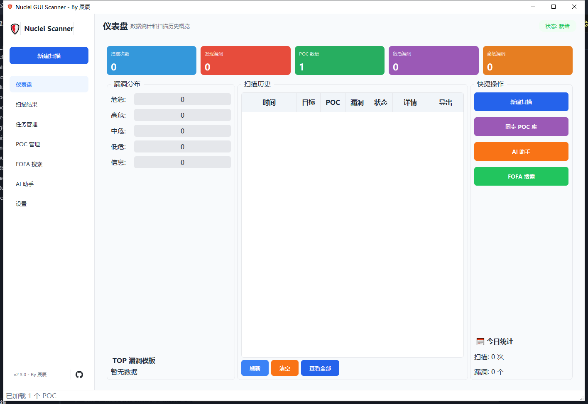
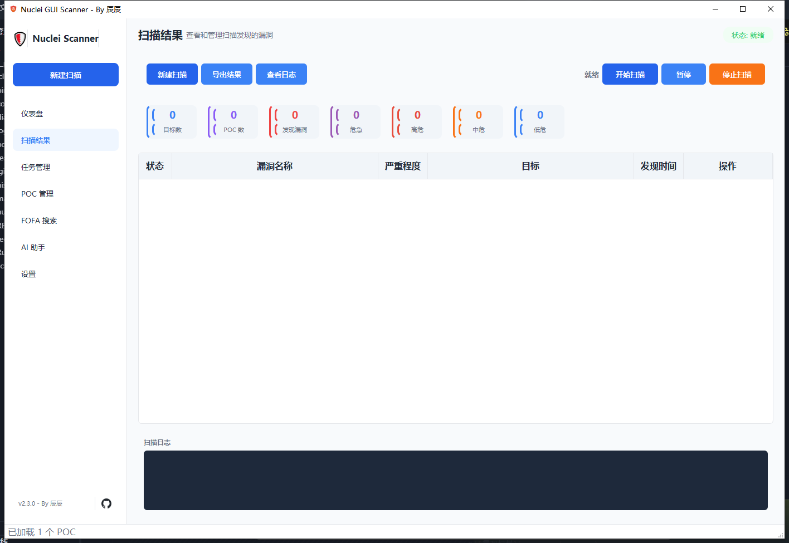
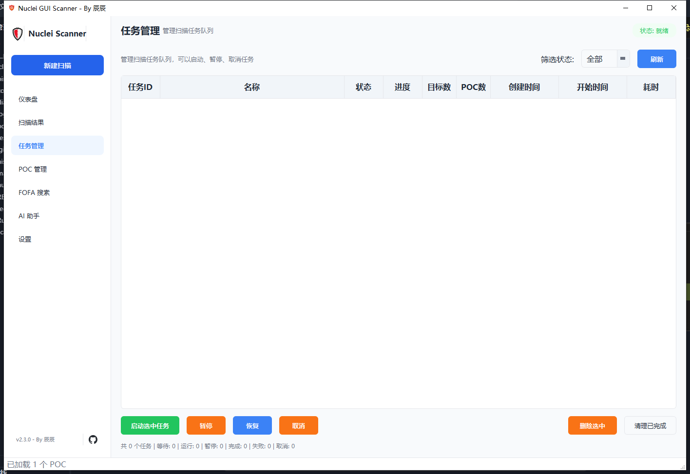
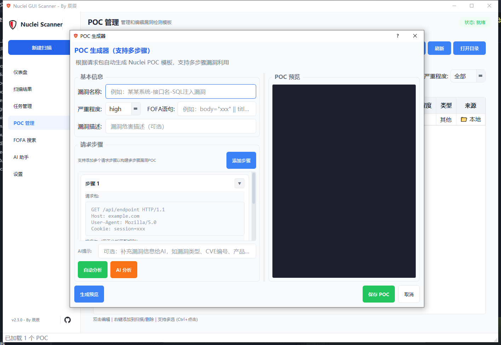

# Nuclei GUI Scanner

基于 PyQt5 开发的 Nuclei 漏洞扫描图形化工具，提供友好的可视化界面，支持 POC 管理、资产搜索、AI 辅助分析等功能。

## 项目信息

- **版本**: 2.3.0
- **作者**: 辰辰
- **技术栈**: Python 3.x + PyQt5 + Nuclei
- **运行平台**: Windows

## 快速开始

### 环境要求

- Python 3.8+
- Windows 10/11

### 安装依赖

```bash
pip install -r requirements.txt
```

### 启动程序

双击 `Run_Nuclei_GUI.bat` 或执行：

```bash
python main.py
```

## 目录结构

```
├── main.py                     # 主程序入口
├── requirements.txt            # Python 依赖
├── Run_Nuclei_GUI.bat          # Windows 启动脚本
│
├── bin/                        # 二进制工具
│   └── nuclei.exe              # Nuclei 扫描引擎
│
├── core/                       # 核心业务模块
│   ├── ai_client.py            # AI 客户端 (OpenAI 兼容接口)
│   ├── nuclei_runner.py        # Nuclei 扫描线程封装
│   ├── task_queue_manager.py   # 任务队列管理器
│   ├── poc_library.py          # POC 库管理
│   ├── fofa_client.py          # FOFA 搜索客户端
│   ├── hunter_client.py        # Hunter 鹰图客户端
│   ├── quake_client.py         # Quake 360 客户端
│   ├── shodan_client.py        # Shodan 客户端
│   ├── settings_manager.py     # 配置管理器
│   ├── scan_history.py         # 扫描历史管理
│   ├── export_manager.py       # 结果导出 (CSV/HTML)
│   ├── vuln_report_generator.py# 漏洞报告生成器
│   ├── proxy_pool.py           # 代理池管理
│   ├── secure_storage.py       # API Key 安全存储
│   ├── fortress_style.py       # UI 主题样式
│   └── logger.py               # 日志模块
│
├── dialogs/                    # 对话框组件
│   ├── ai_assistant_dialog.py  # AI 助手对话框
│   ├── ai_vuln_report_dialog.py# AI 漏洞报告生成
│   ├── fofa_dialog.py          # FOFA 搜索对话框
│   ├── settings_dialog.py      # 设置对话框
│   ├── new_scan_dialog.py      # 新建扫描对话框
│   ├── poc_generator_dialog.py # POC 生成器
│   ├── poc_editor_dialog.py    # POC 编辑器
│   ├── poc_sync_dialog.py      # POC 在线同步
│   ├── poc_test_dialog.py      # POC 测试
│   └── all_scan_history_dialog.py # 扫描历史
│
├── poc_library/                # POC 模板库
│   ├── custom/                 # 用户自定义 POC
│   ├── cloud/                  # 云端同步 POC
│   └── user_generated/         # AI 生成的 POC
│
├── resources/                  # 资源文件
│   └── icon.png                # 应用图标
│
└── logs/                       # 日志目录
```

## 功能截图









## 功能介绍

### 1. 仪表盘

- 扫描统计概览 (总扫描次数、发现漏洞数、POC 数量)
- 漏洞趋势图表
- 最近扫描历史
- 漏洞严重程度分布

### 2. 漏洞扫描

- 支持单目标/批量目标扫描
- 可选择多个 POC 模板
- 实时显示扫描进度和结果
- 支持暂停/恢复/取消扫描
- 扫描结果可导出为 CSV/HTML

### 3. 任务队列管理

- 多任务排队执行
- 任务优先级设置 (紧急/高/普通/低/后台)
- 断点续扫支持
- 任务状态实时监控
- 显示创建时间、开始时间、耗时

### 4. POC 管理

- POC 列表浏览和搜索
- 按严重程度/标签筛选
- POC 导入 (文件/目录)
- POC 在线同步 (从 nuclei-templates 官方仓库)
- POC 编辑器 (语法高亮)
- POC 快速测试
- POC 收藏管理

### 5. 资产搜索

支持多个资产搜索引擎：

| 引擎 | 说明 |
|------|------|
| FOFA | 国内主流资产搜索引擎 |
| Hunter | 奇安信鹰图平台 |
| Quake | 360 网络空间测绘 |
| Shodan | 国际知名搜索引擎 |

- 搜索结果可直接导入为扫描目标
- 搜索历史记录

### 6. AI 助手

支持 OpenAI 兼容接口 (DeepSeek、通义千问、GPT 等)：

| 功能 | 说明 |
|------|------|
| FOFA 语法生成 | 根据漏洞描述生成 FOFA 搜索语法 |
| POC 生成 | 根据漏洞描述生成 Nuclei YAML POC |
| 漏洞分析 | 深入分析漏洞原理和修复建议 |
| 智能推荐 | 根据目标特征推荐适用的 POC |
| 漏洞报告生成 | 生成 SRC 提交格式的漏洞报告 |

### 7. 漏洞报告生成

扫描结果支持一键生成 AI 漏洞报告：

- 补天/SRC 提交报告格式
- 详细技术分析报告
- 简要漏洞说明
- 修复建议报告

### 8. 设置

- **扫描参数**: 超时、并发数、重试次数、代理设置
- **FOFA 配置**: API URL、Email、API Key
- **AI 配置**: 多预设支持、模型选择、API 测试
- **主题设置**: 经典蓝、深邃蓝、清新绿、优雅紫

## 快捷键

| 快捷键 | 功能 |
|--------|------|
| Ctrl+N | 新建扫描 |
| Ctrl+S | 保存设置 |
| Ctrl+E | 导出结果 |
| Ctrl+F | 聚焦搜索框 |
| Ctrl+L | 显示日志 |
| F5 | 刷新 POC 列表 |
| Escape | 停止扫描 |
| Ctrl+1~6 | 快速切换页面 |

## 配置说明

### Nuclei配置

```
将官方Nuclei放入bin目录下
在程序设置中将扫描参数设置选择"跳过探测"和"详细日志"进行打勾
```

### AI 配置

支持任何 OpenAI 兼容接口：

```
API URL: https://api.deepseek.com (或其他兼容接口)
API Key: 你的 API Key
模型: deepseek-chat / gpt-4o / qwen-turbo 等
```

### FOFA 配置

```
API URL: https://fofa.info
Email: 你的 FOFA 邮箱
API Key: 你的 FOFA API Key
```

### 代理设置

支持 HTTP/SOCKS5 代理：

```
http://127.0.0.1:7890
socks5://127.0.0.1:1080
```

## 数据存储

| 文件 | 说明 |
|------|------|
| scan_history.db | 扫描记录和漏洞结果 |
| history.db | FOFA 搜索历史、AI 生成历史 |
| QSettings | 用户配置 (API Key 加密存储) |

## 技术栈

- **GUI 框架**: PyQt5
- **扫描引擎**: Nuclei
- **数据库**: SQLite
- **AI 接口**: OpenAI 兼容 API
- **网络请求**: requests
- **配置存储**: QSettings + 加密存储

## 常见问题

### Q: 扫描没有结果？

1. 检查目标是否可访问
2. 检查 POC 是否适用于目标
3. 查看日志了解详细错误信息

### Q: AI 功能无法使用？

1. 检查 AI 配置是否正确
2. 点击"测试连接"验证 API
3. 确保网络可以访问 AI 服务

### Q: POC 同步失败？

1. 检查网络连接
2. 尝试使用镜像地址
3. 手动下载后导入

## 免责声明

本工具仅供安全研究和授权测试使用，请勿用于非法用途。使用本工具进行任何未授权的测试行为，后果自负。

## 联系方式

如有问题或建议，欢迎联系作者：

- 微信：Mikey7891
- GitHub：https://github.com/ChenChen753/Nuclei_Gui

## 更新日志

### v2.3.0
- 新增 AI POC 生成功能
- 新增单条漏洞 AI任务队列增加时间显示
- UI 样式优化
