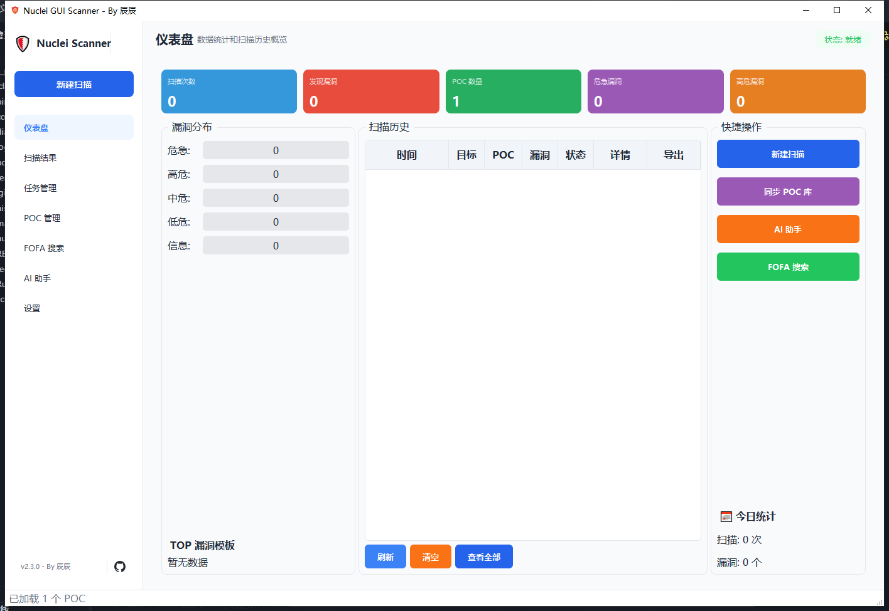
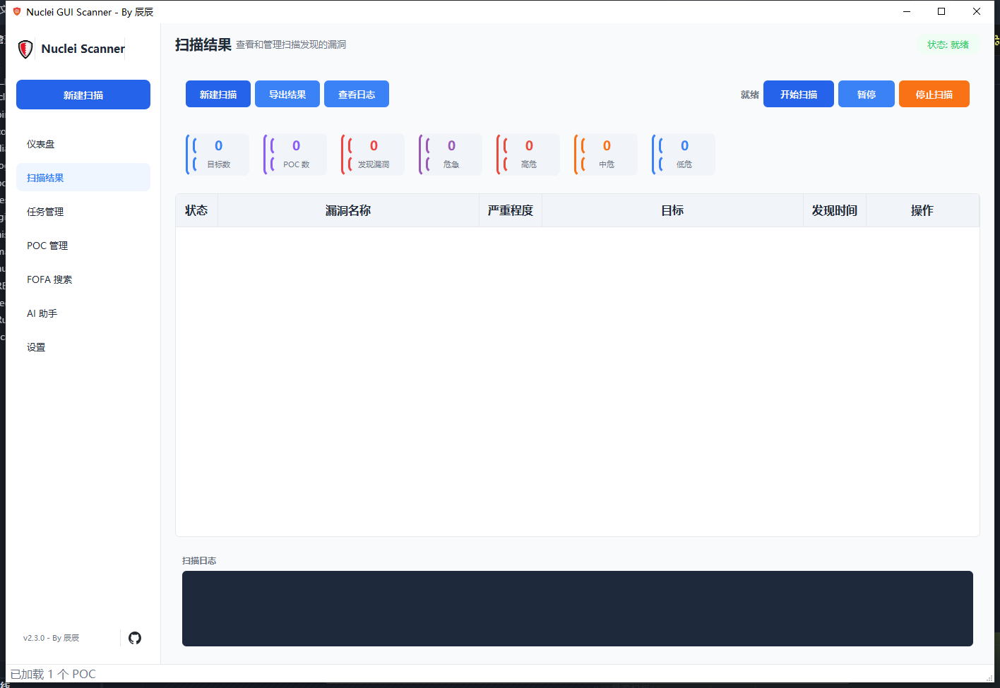
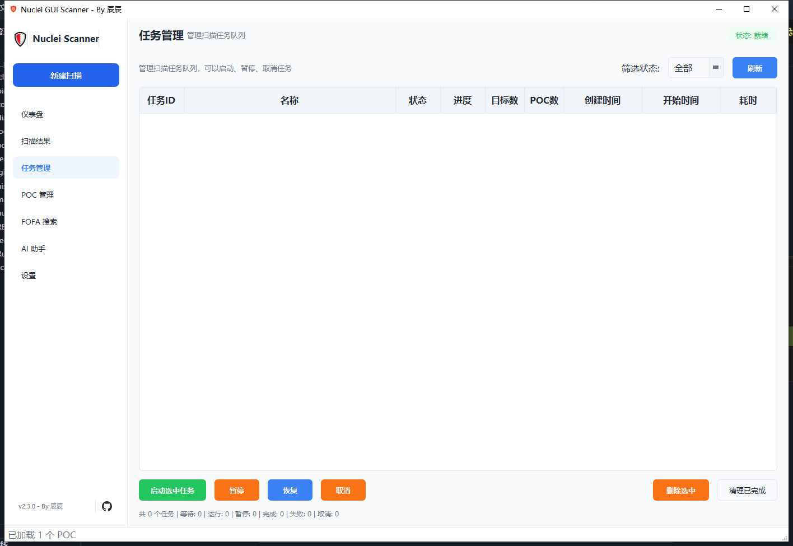
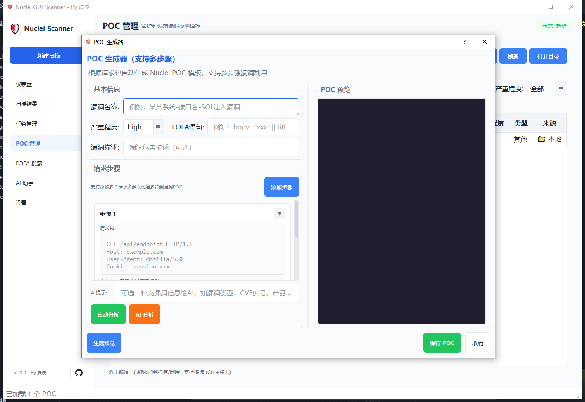

# Nuclei GUI Scanner

基于 PyQt5 开发的 Nuclei 漏洞扫描图形化工具，提供友好的可视化界面，支持 POC 管理、资产搜索、AI 辅助分析等功能。

## 项目信息

- **版本**: 2.4.2
- **作者**: 辰辰
- **技术栈**: Python 3.x + PyQt5 + Nuclei
- **运行平台**: Windows / macOS / Linux（完全跨平台支持）

## 快速开始

### 环境要求

- Python 3.8+
- Windows 10/11 / macOS 10.14+ / Linux (Ubuntu 18.04+)

### 安装依赖

```bash
pip install -r requirements.txt
```

### 安装 Nuclei 扫描引擎

#### 方法一：程序内置下载（推荐）
安装nuclei失败建议连接代理重试

程序启动后会自动检测 Nuclei 状态，如果未安装会显示下载按钮：

1. **主界面下载**：点击"下载最新版本 Nuclei"按钮
2. **设置界面下载**：在设置对话框中点击"下载 Nuclei"按钮

程序会：
- 自动检测您的操作系统和架构
- 从 GitHub 下载最新版本的 Nuclei
- 自动解压并重命名为正确的文件名
- 设置执行权限（Unix 系统）

#### 方法二：命令行自动下载

```bash
# 简化版下载（推荐，网络问题已修复）
python download_nuclei_simple.py

# 带进度条下载
python download_nuclei_with_progress.py
```

#### 方法三：手动安装

1. 访问 [Nuclei Releases](https://github.com/projectdiscovery/nuclei/releases)
2. 下载适合您系统的版本并放入 `bin/` 目录
3. 根据系统重命名文件：
   - **Windows**: `nuclei.exe`
   - **macOS**: `nuclei_darwin`
   - **Linux**: `nuclei_linux`
4. 设置执行权限（Unix 系统）：
   ```bash
   chmod +x bin/nuclei_darwin  # macOS
   chmod +x bin/nuclei_linux   # Linux
   ```

#### 方法四：系统安装

如果您已经在系统中安装了 Nuclei，程序会自动使用系统版本：

```bash
# macOS (使用 Homebrew)
brew install nuclei

# Linux (使用包管理器)
sudo apt install nuclei  # Ubuntu/Debian

# 或者直接下载到系统路径
sudo wget -O /usr/local/bin/nuclei https://github.com/projectdiscovery/nuclei/releases/latest/download/nuclei_linux_amd64
sudo chmod +x /usr/local/bin/nuclei
```

### 启动程序

**Windows**：
```bash
python main.py
# 或双击 Run_Nuclei_GUI.bat
```

**macOS/Linux**：
```bash
python3 main.py
```

## 目录结构

```
├── main.py                          # 主程序入口
├── requirements.txt                 # Python 依赖
├── Run_Nuclei_GUI.bat               # Windows 启动脚本
├── run_nuclei_gui.sh                # macOS/Linux 启动脚本
│
├── bin/                             # 二进制工具目录
│   ├── nuclei.exe                   # Windows Nuclei 扫描引擎
│   ├── nuclei_darwin                # macOS Nuclei 扫描引擎
│   └── nuclei_linux                 # Linux Nuclei 扫描引擎
│
├── download_nuclei_simple.py        # 简化版 Nuclei 下载脚本
├── download_nuclei_with_progress.py # 带进度条 Nuclei 下载脚本
├── setup_nuclei.py                  # Nuclei 环境配置脚本
│
├── core/                            # 核心业务模块
│   ├── ai_client.py                 # AI 客户端 (OpenAI 兼容接口)
│   ├── nuclei_runner.py             # Nuclei 扫描线程封装 (跨平台支持)
│   ├── task_queue_manager.py        # 任务队列管理器
│   ├── poc_library.py               # POC 库管理
│   ├── fofa_client.py               # FOFA 搜索客户端
│   ├── hunter_client.py             # Hunter 鹰图客户端
│   ├── quake_client.py              # Quake 360 客户端
│   ├── shodan_client.py             # Shodan 客户端
│   ├── settings_manager.py          # 配置管理器
│   ├── scan_history.py              # 扫描历史管理
│   ├── export_manager.py            # 结果导出 (CSV/HTML)
│   ├── vuln_report_generator.py     # 漏洞报告生成器
│   ├── proxy_pool.py                # 代理池管理
│   ├── secure_storage.py            # API Key 安全存储
│   ├── fortress_style.py            # UI 主题样式
│   └── logger.py                    # 日志模块
│
├── dialogs/                         # 对话框组件
│   ├── ai_assistant_dialog.py       # AI 助手对话框
│   ├── ai_vuln_report_dialog.py     # AI 漏洞报告生成
│   ├── fofa_dialog.py               # FOFA 搜索对话框
│   ├── settings_dialog.py           # 设置对话框 (集成 Nuclei 下载)
│   ├── new_scan_dialog.py           # 新建扫描对话框
│   ├── poc_generator_dialog.py      # POC 生成器
│   ├── poc_editor_dialog.py         # POC 编辑器
│   ├── poc_sync_dialog.py           # POC 在线同步
│   ├── poc_test_dialog.py           # POC 测试
│   └── all_scan_history_dialog.py   # 扫描历史
│
├── poc_library/                     # POC 模板库
│   ├── custom/                      # 用户自定义 POC
│   ├── cloud/                       # 云端同步 POC
│   └── user_generated/              # AI 生成的 POC
│
├── resources/                       # 资源文件
│   └── icon.png                     # 应用图标
│
└── logs/                            # 日志目录
```

## 功能截图









## 功能介绍

### 1. 仪表盘

- 扫描统计概览 (总扫描次数、发现漏洞数、POC 数量)
- 漏洞趋势图表
- 最近扫描历史
- 漏洞严重程度分布

### 2. 漏洞扫描

- 支持单目标/批量目标扫描
- 可选择多个 POC 模板
- 实时显示扫描进度和结果
- 支持暂停/恢复/取消扫描
- 扫描结果可导出为 CSV/HTML

### 3. 任务队列管理

- 多任务排队执行
- 任务优先级设置 (紧急/高/普通/低/后台)
- 断点续扫支持
- 任务状态实时监控
- 显示创建时间、开始时间、耗时

### 4. POC 管理

- POC 列表浏览和搜索
- 按严重程度/标签筛选
- POC 导入 (文件/目录)
- POC 在线同步 (从 nuclei-templates 官方仓库)
- POC 编辑器 (语法高亮)
- POC 快速测试
- POC 收藏管理

### 5. 资产搜索

支持多个资产搜索引擎：

| 引擎 | 说明 |
|------|------|
| FOFA | 国内主流资产搜索引擎 |
| Hunter | 奇安信鹰图平台 |
| Quake | 360 网络空间测绘 |
| Shodan | 国际知名搜索引擎 |

- 搜索结果可直接导入为扫描目标
- 搜索历史记录

### 6. AI 助手

支持 OpenAI 兼容接口 (DeepSeek、通义千问、GPT 等)：

| 功能 | 说明 |
|------|------|
| FOFA 语法生成 | 根据漏洞描述生成 FOFA 搜索语法 |
| POC 生成 | 根据漏洞描述生成 Nuclei YAML POC |
| 漏洞分析 | 深入分析漏洞原理和修复建议 |
| 智能推荐 | 根据目标特征推荐适用的 POC |
| 漏洞报告生成 | 生成 SRC 提交格式的漏洞报告 |

### 7. 漏洞报告生成

扫描结果支持一键生成 AI 漏洞报告：

- 补天/SRC 提交报告格式
- 详细技术分析报告
- 简要漏洞说明
- 修复建议报告

### 8. 设置

- **扫描参数**: 超时、并发数、重试次数、代理设置
- **FOFA 配置**: API URL、Email、API Key
- **AI 配置**: 多预设支持、模型选择、API 测试
- **主题设置**: 经典蓝、深邃蓝、清新绿、优雅紫
- **Nuclei 管理**: 检测状态、一键下载安装
- **更新设置**: 自动检查更新、手动更新

### 9. 远程更新

程序支持从 GitHub 自动检查和下载更新：

- **启动时自动检查**: 可在设置中开启/关闭
- **手动检查更新**: 在设置页面点击"检查更新"按钮
- **一键下载更新**: 发现新版本后可直接下载安装
- **数据保留**: 更新时自动保留以下数据：
  - 扫描历史数据库 (scan_history.db, history.db)
  - 自定义 POC (poc_library/custom, poc_library/user_generated)
  - 配置文件和日志
- **更新日志显示**: 显示新版本的更新内容

## 快捷键

| 快捷键 | 功能 |
|--------|------|
| Ctrl+N | 新建扫描 |
| Ctrl+S | 保存设置 |
| Ctrl+E | 导出结果 |
| Ctrl+F | 聚焦搜索框 |
| Ctrl+L | 显示日志 |
| F5 | 刷新 POC 列表 |
| Escape | 停止扫描 |
| Ctrl+1~6 | 快速切换页面 |

## 配置说明

### AI 配置

支持任何 OpenAI 兼容接口：

```
API URL: https://api.deepseek.com (或其他兼容接口)
API Key: 你的 API Key
模型: deepseek-chat / gpt-4o / qwen-turbo 等
```

### FOFA 配置

```
API URL: https://fofa.info
Email: 你的 FOFA 邮箱
API Key: 你的 FOFA API Key
```

### 代理设置

支持 HTTP/SOCKS5 代理：

```
http://127.0.0.1:7890
socks5://127.0.0.1:1080
```

## 数据存储

| 文件 | 说明 |
|------|------|
| scan_history.db | 扫描记录和漏洞结果 |
| history.db | FOFA 搜索历史、AI 生成历史 |
| QSettings | 用户配置 (API Key 加密存储) |

## 技术栈

- **GUI 框架**: PyQt5
- **扫描引擎**: Nuclei
- **数据库**: SQLite
- **AI 接口**: OpenAI 兼容 API
- **网络请求**: requests
- **配置存储**: QSettings + 加密存储

## 常见问题

### Q: 扫描没有结果？

1. 检查目标是否可访问
2. 检查 POC 是否适用于目标
3. 查看日志了解详细错误信息

### Q: AI 功能无法使用？

1. 检查 AI 配置是否正确
2. 点击"测试连接"验证 API
3. 确保网络可以访问 AI 服务

### Q: POC 同步失败？

1. 检查网络连接
2. 尝试使用镜像地址
3. 手动下载后导入

## 免责声明

本工具仅供安全研究和授权测试使用，请勿用于非法用途。使用本工具进行任何未授权的测试行为，后果自负。

## 联系方式

如有问题或建议，欢迎联系作者：

- 微信：Mikey7891
- GitHub：https://github.com/ChenChen753/Nuclei_Gui

## 跨平台支持

本工具现已支持 Windows、macOS 和 Linux 系统，实现了完全的跨平台兼容性。

### 系统兼容性

| 操作系统 | 架构 | 二进制文件名 | 状态 |
|---------|------|-------------|------|
| Windows | x64/x86 | `nuclei.exe` | ✅ 完全支持 |
| macOS | Intel/Apple Silicon | `nuclei_darwin` | ✅ 完全支持 |
| Linux | x64/ARM | `nuclei_linux` | ✅ 完全支持 |

### 技术实现

#### 1. 自动系统检测
程序启动时会自动：
- 检测操作系统类型 (`platform.system()`)
- 识别系统架构 (x64/ARM/Apple Silicon)
- 选择对应的 Nuclei 二进制文件

#### 2. 智能路径查找
[`get_nuclei_path()`](core/nuclei_runner.py:26) 函数按以下优先级查找：
1. **bin/ 目录下的专用二进制文件**（优先）
2. **系统 PATH 中的 nuclei 命令**（回退）
3. **默认 nuclei 命令**（最后尝试）

#### 3. 自动权限管理
- **Unix 系统**：自动设置可执行权限 (`chmod 755`)
- **Windows 系统**：无需额外权限设置

#### 4. 内置下载支持
- **主界面集成**：一键下载对应系统的 Nuclei 版本
- **自动重命名**：下载后自动重命名为正确的文件名
- **进度显示**：实时显示下载进度和状态

### 使用说明

#### 首次使用
1. 启动程序后会自动检测 Nuclei 状态
2. 如果未安装，点击"下载最新版本 Nuclei"按钮
3. 程序会自动下载并配置对应系统的版本

#### 故障排除
- **权限错误（macOS/Linux）**：
  ```bash
  chmod +x bin/nuclei_darwin  # 或 nuclei_linux
  ```
- **找不到 Nuclei**：确保 bin/ 目录下有对应平台的二进制文件
- **下载失败**：检查网络连接或尝试手动下载

详细说明请参考：[跨平台支持文档](CROSS_PLATFORM.md)

## 更新日志

### v2.4.1 (当前版本)
- ✅ **修复更新弹窗跳转问题**：启动时点击更新提示现在正确跳转到内嵌设置页面
- ✅ **代理支持**：更新功能自动检测并使用系统代理（环境变量 + Windows 注册表）

### v2.4.0
- ✅ **远程更新功能**：支持从 GitHub 自动检查和下载更新
- ✅ **启动时自动检查更新**：可在设置中开启/关闭
- ✅ **数据保留更新**：更新时自动保留数据库、自定义 POC、配置文件
- ✅ **更新日志显示**：显示新版本的更新内容
- ✅ **多 POC 扫描修复**：修复大量 POC 同时扫描时命令行长度超限的问题

### v2.3.1
- ✅ **完全跨平台支持**：Windows/macOS/Linux 全平台兼容
- ✅ **智能系统检测**：自动识别操作系统和架构
- ✅ **内置下载功能**：主界面和设置界面集成 Nuclei 下载
- ✅ **自动路径管理**：智能查找和使用正确的 Nuclei 二进制文件
- ✅ **权限自动设置**：Unix 系统自动设置执行权限
- ✅ **多下载方式**：简化版和带进度条版本下载脚本
- ✅ **跨平台测试**：新增测试脚本验证多系统兼容性
- ✅ **代码优化**：清理冗余文件，精简代码库
- ✅ **文档完善**：详细的跨平台支持文档

### v2.3.0
- ✅ 新增 AI POC 生成功能
- ✅ 新增单条漏洞 AI 分析报告
- ✅ 任务队列增加时间显示
- ✅ UI 样式优化
